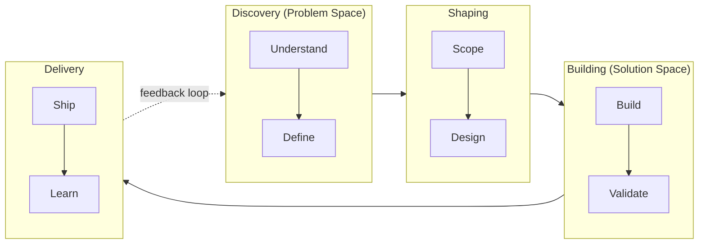
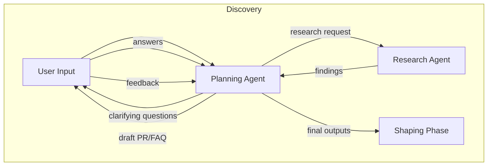
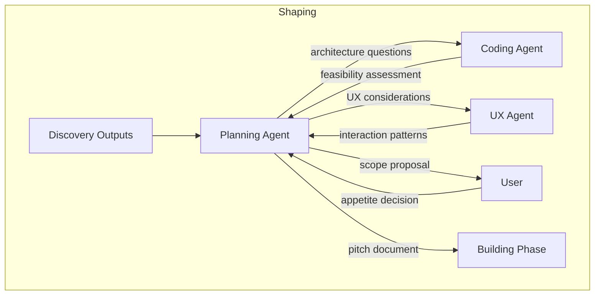
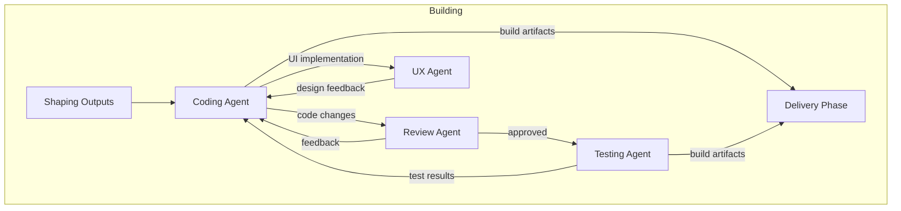
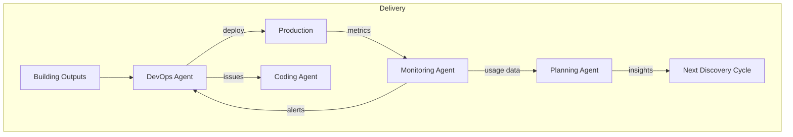
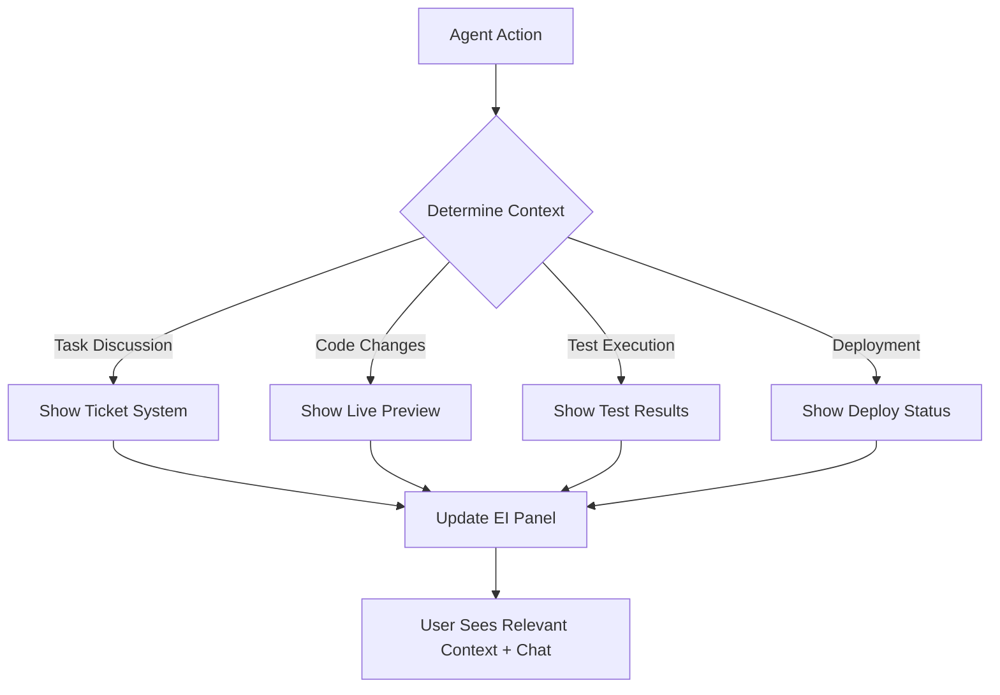

# Product Development Flow

## Overview

This document defines the core product development workflow that AgentForge follows when building software. It synthesizes proven methodologies from industry leaders into a cohesive process optimized for AI-assisted development.

## Research Foundation

This workflow draws from methodologies used by successful companies:

| Company | Methodology | Key Insight |
|---------|-------------|-------------|
| Amazon | [Working Backwards](https://www.productplan.com/glossary/working-backward-amazon-method/) | Start with customer outcomes, write the press release first |
| Basecamp | [Shape Up](https://basecamp.com/shapeup) | Fixed time, variable scope; 6-week cycles with cool-down |
| Google | [Design Sprint](https://designsprintkit.withgoogle.com/methodology) | Compress months of work into focused 5-day sprints |
| IDEO | [Human-Centered Design](https://www.ideou.com/blogs/inspiration/what-is-human-centered-design) | Design with people, not just for them |
| Design Council | [Double Diamond](https://www.designcouncil.org.uk/our-resources/the-double-diamond/) | Diverge then converge, twice: problem then solution |
| Teresa Torres | [Continuous Discovery](https://www.producttalk.org/getting-started-with-discovery/) | Weekly customer touchpoints, opportunity solution trees |

---

## The AgentForge Development Flow

Our process combines the best elements into four distinct phases:



---

## Phase 1: Discovery

**Goal:** Understand the problem deeply before jumping to solutions.

*Inspired by: Amazon's Working Backwards, Double Diamond's first diamond, Continuous Discovery*

### Activities

#### 1.1 Understand
- **Customer interviews** - Who has this problem? How do they experience it?
- **Problem statement** - What problem are we solving? Why does it matter?
- **Stakeholder mapping** - Who is affected? Who has influence?
- **Current state analysis** - How is this handled today?

#### 1.2 Define
- **Outcome definition** - What does success look like? (measurable)
- **Constraints identification** - Technical, business, regulatory limits
- **Opportunity framing** - Frame as opportunity, not just problem
- **PR/FAQ draft** - Write the press release announcing the finished product

### Outputs
- Problem statement document
- Target outcome with success metrics
- Draft PR/FAQ (Amazon-style)
- Opportunity solution tree root

### Key Questions
1. Who is the customer?
2. What is their problem or opportunity?
3. What is the most critical benefit we can provide?
4. How do we know this is what they need?

---

## Phase 2: Shaping

**Goal:** Define the solution at the right level of abstraction - not too vague, not too detailed.

*Inspired by: Shape Up's shaping phase, Design Sprint's sketch/decide*

### Activities

#### 2.1 Scope
- **Appetite setting** - How much time is this worth? (small: 1-2 weeks, medium: 3-4 weeks, large: 5-6 weeks)
- **Boundary definition** - What's in scope? What's explicitly out?
- **Risk identification** - What could go wrong? What unknowns exist?
- **Rabbit hole avoidance** - Identify and cap time-sink areas

#### 2.2 Design
- **Solution sketching** - Broad strokes, not wireframes
- **Technical approach** - High-level architecture decisions
- **Breadboarding** - Map the flow without visual design
- **Fat marker sketches** - Rough UI concepts (intentionally low-fidelity)

### Outputs
- Pitch document with:
  - Problem summary
  - Appetite (time budget)
  - Solution sketch
  - Rabbit holes identified
  - No-gos (out of scope)
- Technical approach outline
- Risk mitigation plan

### Shaping Principles
- **Shaped work is rough** - Leave room for builder creativity
- **Shaped work is solved** - Main elements figured out
- **Shaped work is bounded** - Clear what's out of scope

---

## Phase 3: Building

**Goal:** Build the solution within the fixed time budget, adjusting scope as needed.

*Inspired by: Shape Up's building phase, Agile principles, Google Design Sprint's prototype phase*

### Activities

#### 3.1 Build
- **Vertical slices** - Build end-to-end functionality, not layers
- **Must-haves first** - Core functionality before nice-to-haves
- **Scope hammering** - Cut scope to fit time, not the reverse
- **Continuous integration** - Always have working software

#### 3.2 Validate
- **Internal testing** - Does it work as intended?
- **Edge case handling** - What happens in unusual situations?
- **Performance validation** - Is it fast enough?
- **Security review** - Are there vulnerabilities?

### Outputs
- Working software
- Test coverage
- Documentation (user-facing)
- Deployment artifacts

### Building Principles
- **Fixed time, variable scope** - Deadline is sacred, features are negotiable
- **No task assignment** - Team self-organizes around the work
- **Vertical integration** - Designers and developers work together
- **Get one piece done** - Finish something real before starting more

---

## Phase 4: Delivery

**Goal:** Ship to users and learn from real-world usage.

*Inspired by: Continuous Discovery, Lean Startup, Netflix A/B testing*

### Activities

#### 4.1 Ship
- **Staged rollout** - Start with subset of users
- **Feature flags** - Control exposure
- **Monitoring setup** - Know when things break
- **Rollback readiness** - Quick recovery if needed

#### 4.2 Learn
- **Usage metrics** - Are people using it? How?
- **Customer feedback** - What do they say?
- **Outcome measurement** - Did we hit our success metrics?
- **Retrospective** - What did we learn about our process?

### Outputs
- Deployed product/feature
- Usage analytics
- Customer feedback synthesis
- Retrospective insights
- Input for next discovery cycle

### Feedback Loop
Learning feeds directly back into Discovery:
- New problems discovered
- Opportunities identified
- Assumptions validated/invalidated
- Next iteration scoped

---

## Cycle Timing

```
┌─────────────────────────────────────────────────────────────┐
│                        6-Week Cycle                          │
├─────────────┬─────────────┬─────────────┬─────────────────────┤
│  Discovery  │   Shaping   │  Building   │      Delivery       │
│   1 week    │   1 week    │  3 weeks    │       1 week        │
└─────────────┴─────────────┴─────────────┴─────────────────────┘
                                                    │
┌─────────────────────────────────────────────────────────────┐
│                      Cool-Down (1 week)                      │
│        Bug fixes, learning, prep for next cycle              │
└─────────────────────────────────────────────────────────────┘
```

**Notes:**
- Timing is flexible based on project size
- Small projects may compress to 2-week cycles
- Large initiatives may span multiple cycles
- Cool-down is essential - never skip it

---

## Human Checkpoints

Users can configure approval gates:

| Checkpoint | When | Purpose |
|------------|------|---------|
| Problem Approval | End of Discovery | Confirm we're solving the right problem |
| Pitch Approval | End of Shaping | Approve approach before building |
| Ship Approval | End of Building | Final sign-off before release |

---

## Agent Responsibilities by Phase

| Phase | Primary Agent | Supporting Agents |
|-------|---------------|-------------------|
| Discovery | Planning Agent | Research Agent |
| Shaping | Planning Agent | Coding Agent (feasibility), UX Agent |
| Building | Coding Agent | Review Agent, Testing Agent, UX Agent |
| Delivery | DevOps Agent | Testing Agent, Monitoring Agent |

---

## Agent Workflows by Phase

### Phase 1: Discovery - Agent Workflow



**Planning Agent Tasks:**
| Task | Description | Methodology Source |
|------|-------------|-------------------|
| Problem Extraction | Parse user input to identify core problem vs. symptoms | Double Diamond |
| Stakeholder Identification | Map who is affected and who has influence | Human-Centered Design |
| Outcome Definition | Define measurable success criteria | Continuous Discovery |
| PR/FAQ Drafting | Write press release and anticipated questions | Amazon Working Backwards |
| Opportunity Framing | Reframe problems as opportunities | Continuous Discovery |
| Constraint Documentation | Identify technical, business, regulatory limits | Shape Up |

**Research Agent Tasks:** *(New Agent)*
| Task | Description | Methodology Source |
|------|-------------|-------------------|
| Competitive Analysis | Research existing solutions in the market | Design Sprint |
| Technical Feasibility Scan | Quick assessment of technical approaches | Shape Up |
| User Research Synthesis | Gather and summarize relevant user insights | Human-Centered Design |
| Domain Knowledge Gathering | Research industry-specific requirements | Working Backwards |

**Handoff to Shaping:**
- Problem statement document
- Success metrics
- Draft PR/FAQ
- Research findings
- Identified constraints

---

### Phase 2: Shaping - Agent Workflow



**Planning Agent Tasks:**
| Task | Description | Methodology Source |
|------|-------------|-------------------|
| Appetite Setting | Propose time budget options (small/medium/large) | Shape Up |
| Scope Definition | Define what's in and explicitly out | Shape Up |
| Solution Sketching | Create breadboards and fat-marker sketches | Shape Up |
| Risk Identification | Identify rabbit holes and unknowns | Shape Up |
| Task Decomposition | Break work into buildable chunks | Agile |
| Pitch Document Creation | Compile all shaping work into pitch | Shape Up |

**Coding Agent Tasks (Feasibility):**
| Task | Description | Methodology Source |
|------|-------------|-------------------|
| Technical Spike | Quick proof-of-concept for risky areas | Agile |
| Architecture Proposal | High-level technical approach | Design Sprint |
| Dependency Analysis | Identify external dependencies and risks | Shape Up |
| Effort Estimation | Rough complexity assessment | Agile |

**UX Agent Tasks:** *(New Agent)*
| Task | Description | Methodology Source |
|------|-------------|-------------------|
| Interaction Flow Design | Map user journeys and interactions | Human-Centered Design |
| Component Selection | Identify reusable UI patterns needed | Design Sprint |
| Accessibility Planning | Ensure inclusive design considerations | Human-Centered Design |
| Prototype Sketching | Low-fidelity interaction mockups | Design Sprint |

**Handoff to Building:**
- Approved pitch document
- Technical approach
- Interaction flows
- Identified risks with mitigations
- Clear scope boundaries

---

### Phase 3: Building - Agent Workflow



**Coding Agent Tasks:**
| Task | Description | Methodology Source |
|------|-------------|-------------------|
| Vertical Slice Implementation | Build end-to-end features, not layers | Shape Up |
| Must-Have Prioritization | Core functionality first | Shape Up |
| Scope Hammering | Cut scope to fit time when needed | Shape Up |
| Continuous Integration | Keep software always working | Agile |
| Code Documentation | Document as you build | Agile |
| Bug Fixing | Address issues as they arise | Agile |

**Review Agent Tasks:**
| Task | Description | Methodology Source |
|------|-------------|-------------------|
| Code Review | Quality and standards compliance | Agile |
| Security Scanning | Identify vulnerabilities | DevSecOps |
| Performance Review | Identify bottlenecks | Agile |
| Architecture Compliance | Ensure alignment with plan | Shape Up |
| Documentation Review | Verify docs match implementation | Agile |

**Testing Agent Tasks:**
| Task | Description | Methodology Source |
|------|-------------|-------------------|
| Unit Test Creation | Test individual components | Agile |
| Integration Testing | Test component interactions | Agile |
| Edge Case Identification | Find boundary conditions | Agile |
| Regression Testing | Ensure existing functionality works | Agile |
| Test Coverage Analysis | Identify untested code paths | Agile |

**UX Agent Tasks:**
| Task | Description | Methodology Source |
|------|-------------|-------------------|
| Visual Implementation Review | Ensure design fidelity | Human-Centered Design |
| Interaction Verification | Confirm flows work as designed | Design Sprint |
| Responsive Testing | Verify across screen sizes | Human-Centered Design |
| Accessibility Validation | WCAG compliance checks | Human-Centered Design |

**Handoff to Delivery:**
- Working software
- Test suite with passing tests
- Documentation
- Deployment artifacts
- Known limitations

---

### Phase 4: Delivery - Agent Workflow



**DevOps Agent Tasks:**
| Task | Description | Methodology Source |
|------|-------------|-------------------|
| Deployment Pipeline Setup | Configure CI/CD | Agile |
| Staged Rollout | Incremental user exposure | Netflix A/B |
| Feature Flag Management | Control feature visibility | Continuous Delivery |
| Rollback Execution | Quick recovery when needed | Agile |
| Infrastructure Provisioning | Set up required resources | DevOps |
| Environment Configuration | Manage staging/production configs | DevOps |

**Monitoring Agent Tasks:** *(New Agent)*
| Task | Description | Methodology Source |
|------|-------------|-------------------|
| Metric Collection | Gather usage and performance data | Continuous Discovery |
| Alert Configuration | Set up meaningful alerts | DevOps |
| Anomaly Detection | Identify unusual patterns | Netflix A/B |
| Usage Analysis | Track feature adoption | Continuous Discovery |
| Performance Monitoring | Track response times, errors | DevOps |
| Feedback Aggregation | Collect and categorize user feedback | Continuous Discovery |

**Testing Agent Tasks (Production):**
| Task | Description | Methodology Source |
|------|-------------|-------------------|
| Smoke Testing | Verify deployment success | Agile |
| Production Validation | Confirm features work in prod | Continuous Delivery |
| A/B Test Analysis | Compare variant performance | Netflix A/B |

**Planning Agent Tasks (Learning):**
| Task | Description | Methodology Source |
|------|-------------|-------------------|
| Outcome Measurement | Compare results to success metrics | Continuous Discovery |
| Retrospective Facilitation | Document learnings | Agile |
| Next Cycle Input | Feed insights into discovery | Continuous Discovery |
| Assumption Validation | Confirm or invalidate hypotheses | Lean Startup |

---

## New Agents Identified

Based on methodology gaps, these agents should be added:

### Research Agent
**Purpose:** Gather external information to inform decisions

**Why Needed:**
- Human-Centered Design emphasizes user research
- Working Backwards requires understanding customer context
- Design Sprint includes competitive analysis

**Responsibilities:**
- Competitive analysis
- Market research
- User research synthesis
- Domain knowledge gathering
- Technical landscape scanning

---

### UX Agent
**Purpose:** Ensure user experience quality throughout development

**Why Needed:**
- Human-Centered Design is user-centric throughout
- Design Sprint has dedicated design activities
- Shape Up uses breadboards and fat-marker sketches

**Responsibilities:**
- Interaction flow design
- Accessibility planning
- Visual design review
- Prototype creation
- Usability validation

---

### Monitoring Agent
**Purpose:** Track production health and gather insights

**Why Needed:**
- Continuous Discovery requires ongoing feedback
- Netflix model relies on data-driven decisions
- Lean Startup needs metrics for validation

**Responsibilities:**
- Metric collection and analysis
- Alert management
- Anomaly detection
- Usage pattern analysis
- Feedback aggregation

---

## Updated Agent Summary

| Agent | Primary Phase(s) | Key Methodology Influence |
|-------|------------------|---------------------------|
| Planning Agent | Discovery, Shaping | Working Backwards, Shape Up, Continuous Discovery |
| Research Agent | Discovery | Human-Centered Design, Design Sprint |
| UX Agent | Shaping, Building | Human-Centered Design, Design Sprint |
| Coding Agent | Shaping, Building | Agile, Shape Up |
| Review Agent | Building | Agile, DevSecOps |
| Testing Agent | Building, Delivery | Agile, Continuous Delivery |
| DevOps Agent | Delivery | DevOps, Continuous Delivery |
| Monitoring Agent | Delivery | Continuous Discovery, Netflix A/B |

---

## Adaptive User Interface

The interface dynamically adapts based on agent decisions and current workflow context. The system intelligently determines what should be displayed to the user based on what's happening in real-time.

### Layout Structure (Desktop/Full Screen)

```
┌─────────────────────────────────────────────────────────────────────┐
│                         AgentForge Workspace                         │
├─────────────────────────────────────────────────────────────────────┤
│  ┌──────────────────────────────┐  ┌──────────────────────────────┐ │
│  │                              │  │                              │ │
│  │    ADAPTIVE CONTEXT PANEL    │  │       CHAT WINDOW            │ │
│  │    (Agent-Controlled)        │  │       (Always Visible)       │ │
│  │                              │  │                              │ │
│  │  - Ticket System             │  │  Persistent conversation     │ │
│  │  - Live Demo Preview         │  │  with agents throughout      │ │
│  │  - Test History/Results      │  │  the development process     │ │
│  │  - Code Diff Viewer          │  │                              │ │
│  │  - Architecture Diagrams     │  │                              │ │
│  │  - Deployment Status         │  │                              │ │
│  │                              │  │                              │ │
│  └──────────────────────────────┘  └──────────────────────────────┘ │
└─────────────────────────────────────────────────────────────────────┘
```

### Core Principles

1. **Chat Window Always Present** - The conversation interface remains visible at all times, providing continuous communication with the user
2. **Agent-Driven Context** - Agents decide what contextual information to display based on the current activity
3. **Automatic Transitions** - The UI seamlessly switches between views without manual user intervention

### Context Panel Behavior by Activity

| Agent Activity | Context Panel Shows | Rationale |
|----------------|---------------------|-----------|
| Discussing tasks/progress | Ticket System / Task Board | User sees related tickets and status |
| Running tests | Test History & Results | Real-time test output and historical data |
| Building/coding | Live Demo Preview | See changes as they're made |
| Reviewing code | Code Diff Viewer | Side-by-side comparison of changes |
| Planning architecture | Architecture Diagrams | Visual representation of system design |
| Deploying | Deployment Status | Pipeline progress and logs |
| Debugging | Error Logs & Stack Traces | Relevant debugging information |

### Agent Control Flow



### Implementation Notes

- The context panel should support smooth transitions between views
- Agents emit "context switch" events that trigger UI updates
- Users can optionally pin a specific view to override agent control
- Mobile/tablet layouts may stack panels vertically with chat always accessible

---

## Anti-Patterns to Avoid

### Discovery
- Skipping customer research
- Assuming you know the problem
- Solution-first thinking

### Shaping
- Over-specifying (leaving no room for creativity)
- Under-specifying (too vague to build)
- Ignoring technical feasibility

### Building
- Expanding scope mid-cycle
- Building horizontally instead of vertically
- Waiting until the end to integrate

### Delivery
- Big-bang releases
- Skipping monitoring
- Not measuring outcomes

---

## Templates

*Links to templates will be added as they're created*

- [ ] Problem Statement Template
- [ ] PR/FAQ Template
- [ ] Pitch Document Template
- [ ] Retrospective Template

---

## References

- [Working Backwards - Amazon Method](https://www.productplan.com/glossary/working-backward-amazon-method/)
- [Shape Up - Basecamp](https://basecamp.com/shapeup)
- [Design Sprint Kit - Google](https://designsprintkit.withgoogle.com/methodology)
- [Human-Centered Design - IDEO](https://www.ideou.com/blogs/inspiration/what-is-human-centered-design)
- [Double Diamond - Design Council](https://www.designcouncil.org.uk/our-resources/the-double-diamond/)
- [Continuous Discovery Habits - Teresa Torres](https://www.producttalk.org/getting-started-with-discovery/)
- [Agile at Scale - Atlassian](https://www.atlassian.com/agile/agile-at-scale/spotify)
