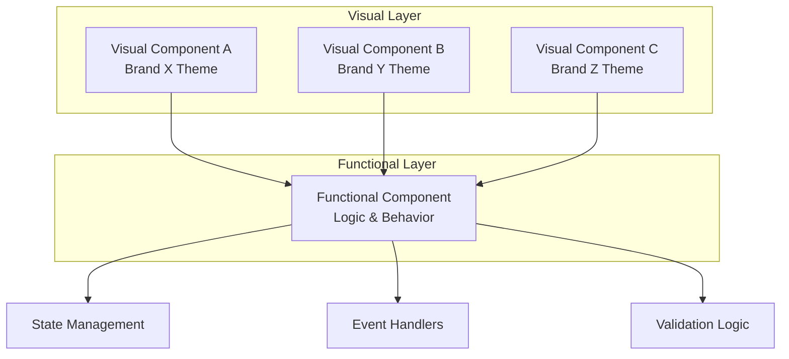

# UI Component Architecture

## Overview

AgentForge separates UI components into two distinct layers: **functional** (behavior/logic) and **visual** (presentation/styling). This enables reusability across different applications with completely different looks and feels while maintaining reliable, well-tested core functionality.

## Architecture



## Layer Responsibilities

### Functional Components

Handle all behavior and logic. These are:
- **Headless** - no visual styling
- **Reusable** - same component works across all themes
- **Testable** - logic can be unit tested in isolation
- **Stable** - rarely need changes once working

**Responsibilities:**
- State management
- Event handling
- Form validation
- API interactions
- Keyboard navigation
- Accessibility (ARIA attributes, focus management)
- Business logic

**Examples:**
- `useForm` - form state, validation, submission
- `useModal` - open/close state, focus trapping
- `useDropdown` - selection state, keyboard nav
- `useDataTable` - sorting, filtering, pagination

### Visual Components

Handle all presentation and styling. These are:
- **Themed** - specific to a brand/application
- **Composable** - wrap functional components
- **Flexible** - easily swapped without changing behavior
- **Isolated** - styling doesn't leak between themes

**Responsibilities:**
- Layout and spacing
- Colors and typography
- Animations and transitions
- Icons and imagery
- Responsive breakpoints
- Theme-specific variations

---

## Implementation Pattern

### Functional Layer (Hooks/Headless)

```typescript
// Functional: handles all dropdown logic
function useDropdown<T>(options: DropdownOptions<T>) {
  const [isOpen, setIsOpen] = useState(false)
  const [selectedIndex, setSelectedIndex] = useState(-1)
  const [selectedValue, setSelectedValue] = useState<T | null>(null)

  const handleKeyDown = (e: KeyboardEvent) => {
    switch (e.key) {
      case 'ArrowDown':
        setSelectedIndex(i => Math.min(i + 1, options.items.length - 1))
        break
      case 'ArrowUp':
        setSelectedIndex(i => Math.max(i - 1, 0))
        break
      case 'Enter':
        if (selectedIndex >= 0) {
          setSelectedValue(options.items[selectedIndex])
          setIsOpen(false)
        }
        break
      case 'Escape':
        setIsOpen(false)
        break
    }
  }

  return {
    isOpen,
    selectedIndex,
    selectedValue,
    open: () => setIsOpen(true),
    close: () => setIsOpen(false),
    toggle: () => setIsOpen(!isOpen),
    select: (value: T) => setSelectedValue(value),
    getContainerProps: () => ({ onKeyDown: handleKeyDown }),
    getItemProps: (index: number) => ({
      'aria-selected': index === selectedIndex,
      onClick: () => {
        setSelectedValue(options.items[index])
        setIsOpen(false)
      }
    })
  }
}
```

### Visual Layer (Themed Components)

```typescript
// Visual: Brand X theme
function BrandXDropdown<T>({ items, label, onChange }: DropdownProps<T>) {
  const dropdown = useDropdown({ items, onChange })

  return (
    <div className="brand-x-dropdown" {...dropdown.getContainerProps()}>
      <button
        className="brand-x-dropdown__trigger"
        onClick={dropdown.toggle}
      >
        {dropdown.selectedValue ?? label}
        <ChevronIcon direction={dropdown.isOpen ? 'up' : 'down'} />
      </button>

      {dropdown.isOpen && (
        <ul className="brand-x-dropdown__menu">
          {items.map((item, i) => (
            <li
              key={i}
              className="brand-x-dropdown__item"
              {...dropdown.getItemProps(i)}
            >
              {item}
            </li>
          ))}
        </ul>
      )}
    </div>
  )
}

// Visual: Brand Y theme - same logic, different look
function BrandYDropdown<T>({ items, label, onChange }: DropdownProps<T>) {
  const dropdown = useDropdown({ items, onChange })

  return (
    <div className="brand-y-select" {...dropdown.getContainerProps()}>
      <div
        className="brand-y-select__field"
        onClick={dropdown.toggle}
      >
        <span>{dropdown.selectedValue ?? label}</span>
        <ArrowIcon open={dropdown.isOpen} />
      </div>

      <AnimatePresence>
        {dropdown.isOpen && (
          <motion.div className="brand-y-select__options">
            {items.map((item, i) => (
              <motion.div
                key={i}
                className="brand-y-select__option"
                {...dropdown.getItemProps(i)}
              >
                {item}
              </motion.div>
            ))}
          </motion.div>
        )}
      </AnimatePresence>
    </div>
  )
}
```

---

## Component Library Structure

```
src/
├── functional/              # Headless logic layer
│   ├── useForm.ts
│   ├── useModal.ts
│   ├── useDropdown.ts
│   ├── useDataTable.ts
│   ├── useToast.ts
│   ├── useTabs.ts
│   └── index.ts
│
├── themes/                  # Visual implementations
│   ├── base/               # Shared primitives
│   │   ├── tokens.ts       # Design token types
│   │   └── types.ts        # Shared prop types
│   │
│   ├── brand-x/            # Brand X theme
│   │   ├── components/
│   │   │   ├── Dropdown.tsx
│   │   │   ├── Modal.tsx
│   │   │   └── Form.tsx
│   │   ├── styles/
│   │   └── tokens.ts
│   │
│   └── brand-y/            # Brand Y theme
│       ├── components/
│       ├── styles/
│       └── tokens.ts
│
└── index.ts                # Public exports
```

---

## Benefits

| Benefit | Description |
|---------|-------------|
| **Reusability** | Functional components work across all projects |
| **Reliability** | Core logic tested once, used everywhere |
| **Flexibility** | Visual layer can change without breaking behavior |
| **Consistency** | Same interactions across different themes |
| **Maintainability** | Bug fixes in functional layer apply everywhere |
| **Agent-friendly** | Agents can compose reliable primitives |

## Guidelines for Agents

When building UI for new applications:

1. **Check functional layer first** - Does a hook/headless component exist?
2. **Reuse, don't rebuild** - Use existing functional components
3. **Extend if needed** - Add to functional layer for new behaviors
4. **Keep visual separate** - Never put logic in visual components
5. **Test functional layer** - Visual layer only needs visual testing

## Existing Functional Components

*To be populated as components are built*

| Component | Purpose | Status |
|-----------|---------|--------|
| `useForm` | Form state, validation, submission | Planned |
| `useModal` | Modal state, focus trap, escape handling | Planned |
| `useDropdown` | Selection, keyboard nav, ARIA | Planned |
| `useDataTable` | Sort, filter, paginate, select | Planned |
| `useToast` | Notification queue, auto-dismiss | Planned |
| `useTabs` | Tab state, keyboard nav, ARIA | Planned |
| `useCombobox` | Autocomplete, filtering, selection | Planned |
