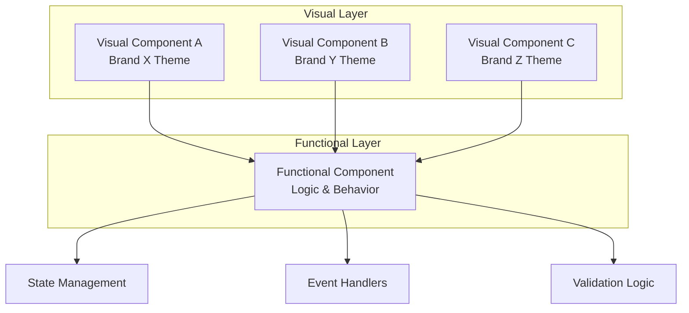

# UI Component Architecture

## Overview

AgentForge separates UI components into two distinct layers: **functional** (behavior/logic) and **visual** (presentation/styling). This enables reusability across different applications with completely different looks and feels while maintaining reliable, well-tested core functionality.

## Architecture



## Layer Responsibilities

### Functional Components

Handle all behavior and logic. These are:
- **Headless** - no visual styling
- **Reusable** - same component works across all themes
- **Testable** - logic can be unit tested in isolation
- **Stable** - rarely need changes once working

**Responsibilities:**
- State management
- Event handling
- Form validation
- API interactions
- Keyboard navigation
- Accessibility (ARIA attributes, focus management)
- Business logic

**Examples:**
- `useForm` - form state, validation, submission
- `useModal` - open/close state, focus trapping
- `useDropdown` - selection state, keyboard nav
- `useDataTable` - sorting, filtering, pagination

### Visual Components

Handle all presentation and styling. These are:
- **Themed** - specific to a brand/application
- **Composable** - wrap functional components
- **Flexible** - easily swapped without changing behavior
- **Isolated** - styling doesn't leak between themes

**Responsibilities:**
- Layout and spacing
- Colors and typography
- Animations and transitions
- Icons and imagery
- Responsive breakpoints
- Theme-specific variations

---

## Implementation Pattern

### Functional Layer (Hooks/Headless)

```typescript
// Functional: handles all dropdown logic
function useDropdown<T>(options: DropdownOptions<T>) {
  const [isOpen, setIsOpen] = useState(false)
  const [selectedIndex, setSelectedIndex] = useState(-1)
  const [selectedValue, setSelectedValue] = useState<T | null>(null)

  const handleKeyDown = (e: KeyboardEvent) => {
    switch (e.key) {
      case 'ArrowDown':
        setSelectedIndex(i => Math.min(i + 1, options.items.length - 1))
        break
      case 'ArrowUp':
        setSelectedIndex(i => Math.max(i - 1, 0))
        break
      case 'Enter':
        if (selectedIndex >= 0) {
          setSelectedValue(options.items[selectedIndex])
          setIsOpen(false)
        }
        break
      case 'Escape':
        setIsOpen(false)
        break
    }
  }

  return {
    isOpen,
    selectedIndex,
    selectedValue,
    open: () => setIsOpen(true),
    close: () => setIsOpen(false),
    toggle: () => setIsOpen(!isOpen),
    select: (value: T) => setSelectedValue(value),
    getContainerProps: () => ({ onKeyDown: handleKeyDown }),
    getItemProps: (index: number) => ({
      'aria-selected': index === selectedIndex,
      onClick: () => {
        setSelectedValue(options.items[index])
        setIsOpen(false)
      }
    })
  }
}
```

### Visual Layer (Themed Components)

```typescript
// Visual: Brand X theme
function BrandXDropdown<T>({ items, label, onChange }: DropdownProps<T>) {
  const dropdown = useDropdown({ items, onChange })

  return (
    <div className="brand-x-dropdown" {...dropdown.getContainerProps()}>
      <button
        className="brand-x-dropdown__trigger"
        onClick={dropdown.toggle}
      >
        {dropdown.selectedValue ?? label}
        <ChevronIcon direction={dropdown.isOpen ? 'up' : 'down'} />
      </button>

      {dropdown.isOpen && (
        <ul className="brand-x-dropdown__menu">
          {items.map((item, i) => (
            <li
              key={i}
              className="brand-x-dropdown__item"
              {...dropdown.getItemProps(i)}
            >
              {item}
            </li>
          ))}
        </ul>
      )}
    </div>
  )
}

// Visual: Brand Y theme - same logic, different look
function BrandYDropdown<T>({ items, label, onChange }: DropdownProps<T>) {
  const dropdown = useDropdown({ items, onChange })

  return (
    <div className="brand-y-select" {...dropdown.getContainerProps()}>
      <div
        className="brand-y-select__field"
        onClick={dropdown.toggle}
      >
        <span>{dropdown.selectedValue ?? label}</span>
        <ArrowIcon open={dropdown.isOpen} />
      </div>

      <AnimatePresence>
        {dropdown.isOpen && (
          <motion.div className="brand-y-select__options">
            {items.map((item, i) => (
              <motion.div
                key={i}
                className="brand-y-select__option"
                {...dropdown.getItemProps(i)}
              >
                {item}
              </motion.div>
            ))}
          </motion.div>
        )}
      </AnimatePresence>
    </div>
  )
}
```

---

## Component Library Structure

```
src/
├── functional/              # Headless logic layer
│   ├── useForm.ts
│   ├── useModal.ts
│   ├── useDropdown.ts
│   ├── useDataTable.ts
│   ├── useToast.ts
│   ├── useTabs.ts
│   └── index.ts
│
├── themes/                  # Visual implementations
│   ├── base/               # Shared primitives
│   │   ├── tokens.ts       # Design token types
│   │   └── types.ts        # Shared prop types
│   │
│   ├── brand-x/            # Brand X theme
│   │   ├── components/
│   │   │   ├── Dropdown.tsx
│   │   │   ├── Modal.tsx
│   │   │   └── Form.tsx
│   │   ├── styles/
│   │   └── tokens.ts
│   │
│   └── brand-y/            # Brand Y theme
│       ├── components/
│       ├── styles/
│       └── tokens.ts
│
└── index.ts                # Public exports
```

---

## Benefits

| Benefit | Description |
|---------|-------------|
| **Reusability** | Functional components work across all projects |
| **Reliability** | Core logic tested once, used everywhere |
| **Flexibility** | Visual layer can change without breaking behavior |
| **Consistency** | Same interactions across different themes |
| **Maintainability** | Bug fixes in functional layer apply everywhere |
| **Agent-friendly** | Agents can compose reliable primitives |

## Guidelines for Agents

When building UI for new applications:

1. **Check functional layer first** - Does a hook/headless component exist?
2. **Reuse, don't rebuild** - Use existing functional components
3. **Extend if needed** - Add to functional layer for new behaviors
4. **Keep visual separate** - Never put logic in visual components
5. **Test functional layer** - Visual layer only needs visual testing

## Functional Components Catalog

This catalog defines the functional (headless) components needed for building business applications. Each component handles behavior and logic only—visual styling is applied separately in the theme layer.

---

### Forms & Input

These components handle user data entry, validation, and form management.

#### `useForm`

Manages complete form lifecycle including field state, validation, and submission.

| Feature | Description |
|---------|-------------|
| Field registration | Dynamic field add/remove with type inference |
| Validation | Sync/async validators, field-level and form-level |
| Dirty tracking | Know when fields change from initial values |
| Touch tracking | Track which fields user has interacted with |
| Error management | Per-field and form-level error messages |
| Submit handling | Prevent double-submit, loading states |
| Reset | Return to initial or empty state |

**Business use cases:** Customer onboarding, order forms, settings pages, data entry screens, multi-step wizards

```typescript
interface UseFormOptions<T> {
  initialValues: T
  validate?: (values: T) => ValidationErrors<T> | Promise<ValidationErrors<T>>
  onSubmit: (values: T) => void | Promise<void>
  validateOnChange?: boolean
  validateOnBlur?: boolean
}

interface UseFormReturn<T> {
  values: T
  errors: ValidationErrors<T>
  touched: TouchedFields<T>
  isDirty: boolean
  isValid: boolean
  isSubmitting: boolean
  getFieldProps: (name: keyof T) => FieldProps
  setFieldValue: (name: keyof T, value: any) => void
  setFieldError: (name: keyof T, error: string) => void
  validateField: (name: keyof T) => Promise<void>
  handleSubmit: (e?: FormEvent) => Promise<void>
  reset: (nextValues?: T) => void
}
```

---

#### `useField`

Manages individual field state—useful for custom inputs or when fields need independent control.

| Feature | Description |
|---------|-------------|
| Value binding | Controlled input state |
| Formatting | Input/output transformers (e.g., currency, phone) |
| Masking | Input masks for structured data |
| Validation | Field-specific validation rules |

**Business use cases:** Phone number inputs, currency fields, SSN/EIN fields, credit card inputs

---

#### `useDropdown`

Handles selection from a list of options with full keyboard support.

| Feature | Description |
|---------|-------------|
| Open/close state | Toggle, open, close controls |
| Selection | Single value selection |
| Keyboard nav | Arrow keys, Enter, Escape, type-ahead |
| ARIA | Listbox pattern compliance |
| Filtering | Optional client-side filtering |

**Business use cases:** Status selectors, category pickers, assignee dropdowns, priority selectors

---

#### `useMultiSelect`

Multi-value selection with tags/chips.

| Feature | Description |
|---------|-------------|
| Multiple selection | Add/remove multiple values |
| Tag management | Visual tag creation and removal |
| Keyboard nav | Navigate and remove with keyboard |
| Search/filter | Filter available options |
| Max selection | Optional limit on selections |

**Business use cases:** Tag assignment, category multi-select, team member assignment, skill selection

---

#### `useCombobox`

Combines text input with dropdown selection—autocomplete pattern.

| Feature | Description |
|---------|-------------|
| Text input | Free-form typing |
| Suggestions | Filtered option list |
| Async loading | Load options from API as user types |
| Debouncing | Configurable input debounce |
| Create new | Optionally allow creating new options |
| Highlighting | Match highlighting in suggestions |

**Business use cases:** Customer lookup, product search, address autocomplete, mention/tagging

---

#### `useDatePicker`

Date and date range selection.

| Feature | Description |
|---------|-------------|
| Single date | Pick one date |
| Date range | Pick start and end dates |
| Min/max bounds | Restrict selectable range |
| Disabled dates | Block specific dates |
| Keyboard nav | Full keyboard support |
| Localization | Date format per locale |

**Business use cases:** Booking systems, report date ranges, due date selection, scheduling

---

#### `useTimePicker`

Time selection with configurable intervals.

| Feature | Description |
|---------|-------------|
| Time selection | Hours, minutes, optional seconds |
| 12/24 hour | AM/PM or 24-hour format |
| Intervals | Configurable minute steps (5, 15, 30) |
| Min/max bounds | Restrict selectable times |
| Keyboard input | Type time directly |

**Business use cases:** Appointment scheduling, shift management, delivery windows

---

#### `useDateRangePicker`

Combined date range with optional time selection.

| Feature | Description |
|---------|-------------|
| Preset ranges | Today, This Week, Last 30 Days, etc. |
| Custom range | Manual start/end selection |
| Comparison | Optional comparison period |
| Relative dates | "Last 7 days" type selections |

**Business use cases:** Analytics dashboards, report generation, data exports

---

#### `useFileUpload`

File selection and upload management.

| Feature | Description |
|---------|-------------|
| File selection | Single or multiple files |
| Drag and drop | Drop zone support |
| Validation | File type, size limits |
| Upload progress | Track upload percentage |
| Abort/retry | Cancel or retry failed uploads |
| Preview | Image/file preview generation |

**Business use cases:** Document upload, avatar/logo upload, bulk import, attachments

---

#### `useRichTextEditor`

Rich text editing capabilities.

| Feature | Description |
|---------|-------------|
| Formatting | Bold, italic, underline, etc. |
| Structure | Headings, lists, blockquotes |
| Links | URL insertion and editing |
| Media | Image embedding |
| Mentions | @-mention support |
| Markdown | Optional markdown shortcuts |

**Business use cases:** Email composition, notes, comments, descriptions, documentation

---

### Data Display

Components for presenting and interacting with data.

#### `useDataTable`

Full-featured data table with sorting, filtering, and pagination.

| Feature | Description |
|---------|-------------|
| Sorting | Single and multi-column sort |
| Filtering | Per-column and global filters |
| Pagination | Page-based or infinite scroll |
| Row selection | Single, multi, select-all |
| Column visibility | Show/hide columns |
| Column reordering | Drag to reorder |
| Column resizing | Adjustable widths |
| Row expansion | Expandable detail rows |
| Virtualization | Efficient rendering for large datasets |
| Export | Data export hooks |

**Business use cases:** Order lists, user management, inventory, transaction history, reports

```typescript
interface UseDataTableOptions<T> {
  data: T[]
  columns: ColumnDef<T>[]
  initialSort?: SortState
  initialFilters?: FilterState
  pageSize?: number
  enableRowSelection?: boolean
  onRowClick?: (row: T) => void
}

interface UseDataTableReturn<T> {
  rows: T[]
  sortState: SortState
  filterState: FilterState
  pagination: PaginationState
  selectedRows: T[]
  visibleColumns: string[]
  sort: (columnId: string) => void
  filter: (columnId: string, value: any) => void
  setPage: (page: number) => void
  selectRow: (row: T) => void
  selectAll: () => void
  toggleColumn: (columnId: string) => void
  getHeaderProps: (columnId: string) => HeaderProps
  getRowProps: (row: T) => RowProps
  getCellProps: (row: T, columnId: string) => CellProps
}
```

---

#### `useVirtualList`

Virtualized list for rendering large datasets efficiently.

| Feature | Description |
|---------|-------------|
| Windowing | Only render visible items |
| Variable heights | Support for dynamic item sizes |
| Scroll restoration | Maintain position on re-render |
| Infinite scroll | Load more on scroll |

**Business use cases:** Activity feeds, large lists, chat histories, log viewers

---

#### `usePagination`

Standalone pagination logic.

| Feature | Description |
|---------|-------------|
| Page state | Current page, total pages |
| Navigation | Next, prev, first, last, go to |
| Page size | Configurable items per page |
| URL sync | Optional URL query param sync |

**Business use cases:** Any paginated listing, search results, API-paginated data

---

#### `useTree`

Hierarchical tree structure with expand/collapse.

| Feature | Description |
|---------|-------------|
| Expand/collapse | Toggle node visibility |
| Selection | Single or multi-select nodes |
| Keyboard nav | Arrow key navigation |
| Lazy loading | Load children on expand |
| Drag and drop | Reorder and reparent |

**Business use cases:** File browsers, org charts, category hierarchies, folder structures

---

#### `useKanban`

Kanban board state management.

| Feature | Description |
|---------|-------------|
| Columns | Column definition and ordering |
| Cards | Card positioning within columns |
| Drag and drop | Move cards between columns |
| Swimlanes | Optional horizontal grouping |
| WIP limits | Column card limits |

**Business use cases:** Project boards, pipeline management, workflow visualization

---

### Navigation & Layout

Components for structuring and navigating applications.

#### `useTabs`

Tab panel navigation.

| Feature | Description |
|---------|-------------|
| Active tab | Current tab state |
| Keyboard nav | Arrow key tab switching |
| ARIA | Tablist/tab/tabpanel pattern |
| Lazy render | Optional lazy panel rendering |
| Orientation | Horizontal or vertical |

**Business use cases:** Settings pages, detail views, dashboard sections

---

#### `useAccordion`

Collapsible content sections.

| Feature | Description |
|---------|-------------|
| Single/multi expand | Allow one or multiple open |
| Keyboard nav | Space/Enter to toggle |
| ARIA | Proper accordion pattern |
| Animation hooks | Open/close transition support |

**Business use cases:** FAQs, settings groups, form sections, filters

---

#### `useStepper`

Multi-step wizard navigation.

| Feature | Description |
|---------|-------------|
| Step state | Current, completed, upcoming |
| Navigation | Next, back, go to step |
| Validation | Block progress until valid |
| Linear/non-linear | Strict order or free navigation |
| Step metadata | Labels, descriptions, icons |

**Business use cases:** Checkout flows, onboarding, complex forms, setup wizards

```typescript
interface UseStepperOptions {
  steps: StepDef[]
  initialStep?: number
  linear?: boolean
  onStepChange?: (step: number) => void
  validateStep?: (step: number) => boolean | Promise<boolean>
}

interface UseStepperReturn {
  currentStep: number
  steps: StepState[]
  isFirst: boolean
  isLast: boolean
  canGoNext: boolean
  canGoPrev: boolean
  next: () => Promise<boolean>
  prev: () => void
  goTo: (step: number) => Promise<boolean>
  complete: () => void
  reset: () => void
}
```

---

#### `useBreadcrumb`

Breadcrumb trail generation.

| Feature | Description |
|---------|-------------|
| Path parsing | Generate from route/path |
| Custom items | Manual breadcrumb items |
| Truncation | Collapse middle items on overflow |
| ARIA | Navigation landmark |

**Business use cases:** Deep navigation hierarchies, file paths, category trails

---

#### `useSidebar`

Collapsible sidebar navigation.

| Feature | Description |
|---------|-------------|
| Open/close | Toggle sidebar visibility |
| Collapsed mode | Icon-only compact view |
| Nested items | Sub-navigation support |
| Active tracking | Highlight current item |

**Business use cases:** Main app navigation, admin panels, documentation

---

#### `useCommandPalette`

Keyboard-driven command interface (⌘K pattern).

| Feature | Description |
|---------|-------------|
| Hotkey activation | Configurable trigger key |
| Search | Filter commands by text |
| Sections | Group related commands |
| Recent | Track recently used commands |
| Nested | Sub-command navigation |
| Actions | Execute or navigate |

**Business use cases:** Power user features, quick navigation, action shortcuts

---

### Feedback & Communication

Components for user feedback, notifications, and communication.

#### `useModal`

Modal dialog management.

| Feature | Description |
|---------|-------------|
| Open/close | Toggle modal visibility |
| Focus trap | Keep focus within modal |
| Escape close | Close on Escape key |
| Backdrop close | Optional click-outside close |
| Stack support | Multiple modal handling |
| Scroll lock | Prevent body scroll |
| ARIA | Dialog role and labels |

**Business use cases:** Confirmations, detail views, forms, alerts

---

#### `useDrawer`

Slide-out panel management.

| Feature | Description |
|---------|-------------|
| Position | Left, right, top, bottom |
| Size | Width/height configuration |
| Push content | Optional content push vs overlay |
| Focus management | Same as modal |

**Business use cases:** Detail panels, filters, settings, secondary forms

---

#### `useToast`

Toast notification management.

| Feature | Description |
|---------|-------------|
| Queue | Manage multiple notifications |
| Auto-dismiss | Configurable timeout |
| Types | Success, error, warning, info |
| Actions | Optional action buttons |
| Position | Screen corner positioning |
| Pause on hover | Extend time on mouse over |

**Business use cases:** Action confirmations, error alerts, status updates

```typescript
interface UseToastReturn {
  toasts: Toast[]
  add: (toast: ToastOptions) => string
  remove: (id: string) => void
  success: (message: string, options?: ToastOptions) => string
  error: (message: string, options?: ToastOptions) => string
  warning: (message: string, options?: ToastOptions) => string
  info: (message: string, options?: ToastOptions) => string
  clearAll: () => void
}
```

---

#### `useConfirm`

Confirmation dialog pattern.

| Feature | Description |
|---------|-------------|
| Promise-based | Await user response |
| Customizable | Title, message, button text |
| Destructive mode | Warning styling for dangerous actions |

**Business use cases:** Delete confirmations, abandon changes, irreversible actions

---

#### `useAlert`

Simple alert dialogs.

| Feature | Description |
|---------|-------------|
| Promise-based | Await acknowledgment |
| Types | Info, warning, error |
| Single action | OK/acknowledge button |

**Business use cases:** Error messages, important notices, required acknowledgments

---

#### `useNotifications`

Persistent notification center.

| Feature | Description |
|---------|-------------|
| Notification list | All notifications |
| Read/unread | Track read status |
| Mark read | Individual and bulk |
| Filtering | By type, date, status |
| Real-time | WebSocket/SSE support |

**Business use cases:** App notification center, alerts inbox, updates feed

---

### Business Patterns

Higher-level patterns common in business applications.

#### `useSearch`

Search with filters and results.

| Feature | Description |
|---------|-------------|
| Query state | Search text management |
| Debouncing | Configurable delay |
| Filters | Faceted filter state |
| Results | Results with loading/error |
| History | Recent searches |
| Suggestions | Type-ahead suggestions |

**Business use cases:** Global search, entity search, filtered listings

---

#### `useFilters`

Filter panel state management.

| Feature | Description |
|---------|-------------|
| Filter state | Active filters |
| Apply/clear | Batch apply or reset |
| Presets | Saved filter combinations |
| URL sync | Persist in query params |
| Count | Show result counts per filter |

**Business use cases:** Product filters, report filters, search refinement

---

#### `useBulkActions`

Bulk selection and actions on lists.

| Feature | Description |
|---------|-------------|
| Selection | Select/deselect items |
| Select all | Page or all results |
| Actions | Available bulk operations |
| Progress | Track action progress |

**Business use cases:** Bulk delete, bulk assign, bulk export, bulk status change

---

#### `useInlineEdit`

Click-to-edit pattern.

| Feature | Description |
|---------|-------------|
| View/edit modes | Toggle between display and input |
| Save/cancel | Confirm or discard changes |
| Validation | Validate before save |
| Keyboard | Enter to save, Escape to cancel |

**Business use cases:** Editable table cells, quick edits, inline name editing

---

#### `useCRUD`

Complete create-read-update-delete pattern.

| Feature | Description |
|---------|-------------|
| List state | Items with loading/error |
| Create | Add new items |
| Read | Fetch individual items |
| Update | Modify existing items |
| Delete | Remove items |
| Optimistic | Optional optimistic updates |
| Cache | Result caching |

**Business use cases:** Entity management screens, admin panels, settings

```typescript
interface UseCRUDOptions<T> {
  list: () => Promise<T[]>
  get: (id: string) => Promise<T>
  create: (data: Partial<T>) => Promise<T>
  update: (id: string, data: Partial<T>) => Promise<T>
  delete: (id: string) => Promise<void>
  optimistic?: boolean
}

interface UseCRUDReturn<T> {
  items: T[]
  isLoading: boolean
  error: Error | null
  selected: T | null
  fetch: () => Promise<void>
  select: (id: string) => Promise<void>
  create: (data: Partial<T>) => Promise<T>
  update: (id: string, data: Partial<T>) => Promise<T>
  remove: (id: string) => Promise<void>
  refresh: () => Promise<void>
}
```

---

#### `useWizard`

Multi-step workflow with branching logic.

| Feature | Description |
|---------|-------------|
| Steps | Step definitions with conditions |
| Branching | Conditional step paths |
| Data collection | Aggregate data across steps |
| Progress | Track overall completion |
| Resume | Save and restore progress |

**Business use cases:** Complex onboarding, application forms, guided setup

---

#### `useDashboard`

Dashboard widget management.

| Feature | Description |
|---------|-------------|
| Layout | Widget positioning grid |
| Resize | Widget size adjustment |
| Drag and drop | Rearrange widgets |
| Persistence | Save layout preferences |
| Widget state | Individual widget data |

**Business use cases:** Analytics dashboards, home pages, customizable views

---

#### `useWorkflow`

State machine for business workflows.

| Feature | Description |
|---------|-------------|
| States | Workflow state definitions |
| Transitions | Allowed state changes |
| Guards | Transition conditions |
| Actions | Side effects on transition |
| History | Transition audit trail |

**Business use cases:** Approval workflows, order status, ticket lifecycle

---

#### `useComments`

Comment thread management.

| Feature | Description |
|---------|-------------|
| Thread | Comment list with replies |
| Add/edit/delete | Comment CRUD |
| Mentions | @-mention support |
| Reactions | Emoji reactions |
| Real-time | Live updates |

**Business use cases:** Task comments, document review, collaboration

---

#### `useActivity`

Activity feed/timeline.

| Feature | Description |
|---------|-------------|
| Events | Activity event list |
| Infinite scroll | Load more on scroll |
| Filtering | Filter by type, actor, date |
| Real-time | Live event streaming |

**Business use cases:** Activity logs, audit trails, social feeds

---

### Utilities

Low-level utilities used by other components.

#### `useClickOutside`

Detect clicks outside an element.

---

#### `useFocusTrap`

Keep focus within a container.

---

#### `useKeyboard`

Keyboard shortcut management.

---

#### `useMediaQuery`

Responsive breakpoint detection.

---

#### `useLocalStorage`

Persistent local storage state.

---

#### `useDebounce`

Debounced value updates.

---

#### `useThrottle`

Throttled value updates.

---

#### `useClipboard`

Copy to clipboard functionality.

---

#### `useUndo`

Undo/redo state management.

---

## Implementation Status

| Component | Category | Priority | Status |
|-----------|----------|----------|--------|
| `useForm` | Forms | P0 | Planned |
| `useField` | Forms | P0 | Planned |
| `useDropdown` | Forms | P0 | Planned |
| `useModal` | Feedback | P0 | Planned |
| `useToast` | Feedback | P0 | Planned |
| `useDataTable` | Data Display | P0 | Planned |
| `useTabs` | Navigation | P0 | Planned |
| `useCombobox` | Forms | P1 | Planned |
| `useMultiSelect` | Forms | P1 | Planned |
| `useDatePicker` | Forms | P1 | Planned |
| `useStepper` | Navigation | P1 | Planned |
| `useDrawer` | Feedback | P1 | Planned |
| `usePagination` | Data Display | P1 | Planned |
| `useSearch` | Business | P1 | Planned |
| `useFilters` | Business | P1 | Planned |
| `useCRUD` | Business | P1 | Planned |
| `useAccordion` | Navigation | P2 | Planned |
| `useTree` | Data Display | P2 | Planned |
| `useKanban` | Data Display | P2 | Planned |
| `useRichTextEditor` | Forms | P2 | Planned |
| `useFileUpload` | Forms | P2 | Planned |
| `useCommandPalette` | Navigation | P2 | Planned |
| `useWorkflow` | Business | P2 | Planned |
| `useDashboard` | Business | P2 | Planned |
| `useComments` | Business | P3 | Planned |
| `useActivity` | Business | P3 | Planned |
| `useVirtualList` | Data Display | P3 | Planned |
